# HFT Trading System Architecture

This document provides a structural view of the HFT trading system. Read this before making any changes to understand component relationships and data flow.

## System Overview

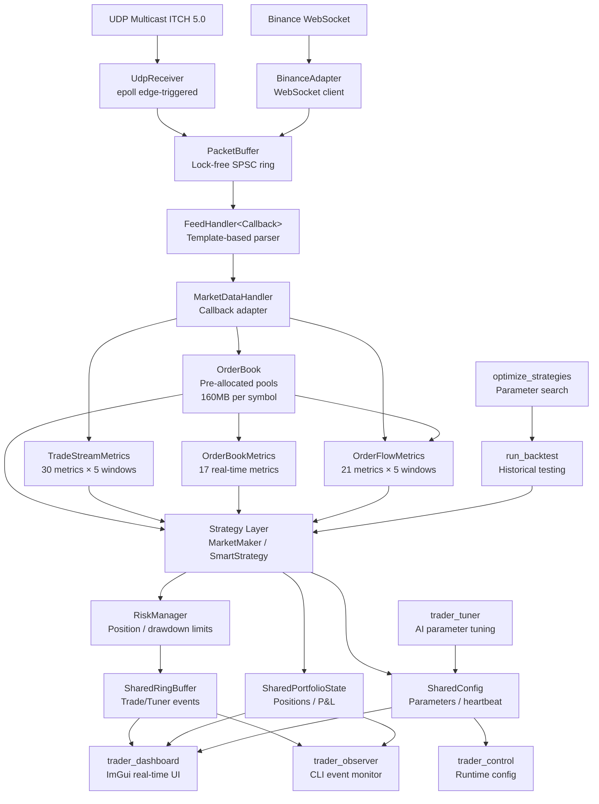
```mermaid
flowchart TD
    %% External Data Sources
    UDP[UDP Multicast ITCH 5.0] --> UdpReceiver
    WebSocket[Binance WebSocket] --> BinanceAdapter

    %% Network Layer
    UdpReceiver[UdpReceiver<br/>epoll edge-triggered] --> PacketBuffer[PacketBuffer<br/>Lock-free SPSC ring]
    BinanceAdapter[BinanceAdapter<br/>WebSocket client] --> PacketBuffer

    %% Parsing Layer
    PacketBuffer --> FeedHandler[FeedHandler&lt;Callback&gt;<br/>Template-based parser]
    FeedHandler --> MDHandler[MarketDataHandler<br/>Callback adapter]

    %% Market Data
    MDHandler --> OrderBook[OrderBook<br/>Pre-allocated pools<br/>160MB per symbol]

    %% Metrics Layer
    MDHandler --> TradeMetrics[TradeStreamMetrics<br/>30 metrics × 5 windows]
    OrderBook --> BookMetrics[OrderBookMetrics<br/>17 real-time metrics]
    MDHandler --> FlowMetrics[OrderFlowMetrics<br/>21 metrics × 5 windows]
    OrderBook --> FlowMetrics

    %% Strategy Layer
    OrderBook --> Strategy[Strategy Layer<br/>MarketMaker / SmartStrategy]
    TradeMetrics --> Strategy
    BookMetrics --> Strategy
    FlowMetrics --> Strategy
    Strategy --> RiskMgr[RiskManager<br/>Position / drawdown limits]

    %% IPC Layer
    RiskMgr --> IPC_Events[SharedRingBuffer<br/>Trade/Tuner events]
    Strategy --> IPC_Portfolio[SharedPortfolioState<br/>Positions / P&L]
    Strategy --> IPC_Config[SharedConfig<br/>Parameters / heartbeat]

    %% Consumers (read-only)
    IPC_Events --> Dashboard[trader_dashboard<br/>ImGui real-time UI]
    IPC_Portfolio --> Dashboard
    IPC_Config --> Dashboard

    IPC_Events --> Observer[trader_observer<br/>CLI event monitor]
    IPC_Portfolio --> Observer

    IPC_Config --> Control[trader_control<br/>Runtime config]

    %% Tools
    Backtest[run_backtest<br/>Historical testing] --> Strategy
    Optimizer[optimize_strategies<br/>Parameter search] --> Backtest
    Tuner[trader_tuner<br/>AI parameter tuning] --> IPC_Config
```

---

## Module: Network

Handles UDP multicast and WebSocket connections with zero-copy packet buffering.

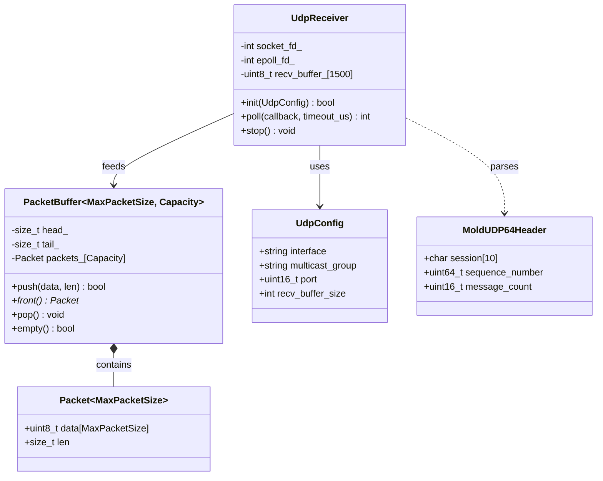
```mermaid
classDiagram
    class UdpReceiver {
        -int socket_fd_
        -int epoll_fd_
        -uint8_t recv_buffer_[1500]
        +init(UdpConfig) bool
        +poll(callback, timeout_us) int
        +stop() void
    }

    class PacketBuffer~MaxPacketSize, Capacity~ {
        -size_t head_
        -size_t tail_
        -Packet packets_[Capacity]
        +push(data, len) bool
        +front() Packet*
        +pop() void
        +empty() bool
    }

    class Packet~MaxPacketSize~ {
        +uint8_t data[MaxPacketSize]
        +size_t len
    }

    class UdpConfig {
        +string interface
        +string multicast_group
        +uint16_t port
        +int recv_buffer_size
    }

    class MoldUDP64Header {
        +char session[10]
        +uint64_t sequence_number
        +uint16_t message_count
    }

    UdpReceiver --> UdpConfig : uses
    UdpReceiver ..> MoldUDP64Header : parses
    PacketBuffer *-- Packet : contains
    UdpReceiver --> PacketBuffer : feeds
```

**Key Constraints:**
- `PacketBuffer` is lock-free SPSC (single-producer, single-consumer)
- `Capacity` must be power of 2
- `UdpReceiver` uses edge-triggered epoll for low latency
- No allocations on hot path

---

## Module: Feed Handler

Template-based protocol parser with compile-time callback binding (zero vtable overhead).

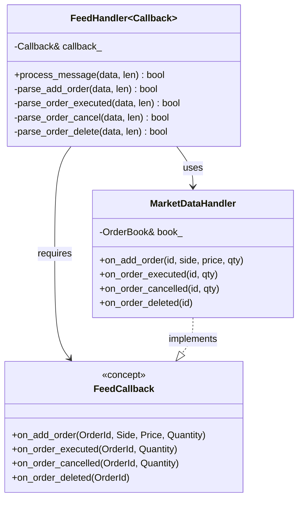
```mermaid
classDiagram
    class FeedHandler~Callback~ {
        -Callback& callback_
        +process_message(data, len) bool
        -parse_add_order(data, len) bool
        -parse_order_executed(data, len) bool
        -parse_order_cancel(data, len) bool
        -parse_order_delete(data, len) bool
    }

    class MarketDataHandler {
        -OrderBook& book_
        +on_add_order(id, side, price, qty)
        +on_order_executed(id, qty)
        +on_order_cancelled(id, qty)
        +on_order_deleted(id)
    }

    class FeedCallback {
        <<concept>>
        +on_add_order(OrderId, Side, Price, Quantity)
        +on_order_executed(OrderId, Quantity)
        +on_order_cancelled(OrderId, Quantity)
        +on_order_deleted(OrderId)
    }

    FeedHandler --> FeedCallback : requires
    MarketDataHandler ..|> FeedCallback : implements
    FeedHandler --> MarketDataHandler : uses
```

**Key Constraints:**
- `FeedHandler` is template-based (no virtual dispatch)
- Callback must satisfy `FeedCallback` concept
- Protocol-specific (ITCH 5.0), but same interface for other feeds
- Hot path: 3+ params allowed (exception to global rule)

---

## Module: Order Book

Pre-allocated pool-based order book with O(1) operations.

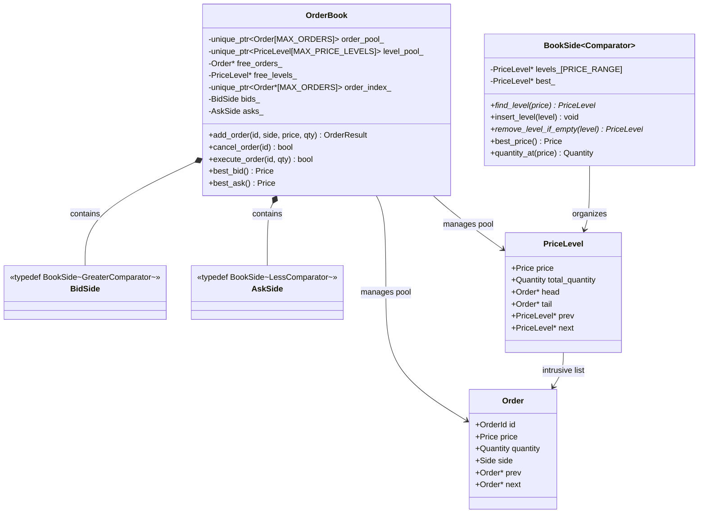
```mermaid
classDiagram
    class OrderBook {
        -unique_ptr~Order[MAX_ORDERS]~ order_pool_
        -unique_ptr~PriceLevel[MAX_PRICE_LEVELS]~ level_pool_
        -Order* free_orders_
        -PriceLevel* free_levels_
        -unique_ptr~Order*[MAX_ORDERS]~ order_index_
        -BidSide bids_
        -AskSide asks_
        +add_order(id, side, price, qty) OrderResult
        +cancel_order(id) bool
        +execute_order(id, qty) bool
        +best_bid() Price
        +best_ask() Price
    }

    class BookSide~Comparator~ {
        -PriceLevel* levels_[PRICE_RANGE]
        -PriceLevel* best_
        +find_level(price) PriceLevel*
        +insert_level(level) void
        +remove_level_if_empty(level) PriceLevel*
        +best_price() Price
        +quantity_at(price) Quantity
    }

    class BidSide {
        <<typedef BookSide~GreaterComparator~>>
    }

    class AskSide {
        <<typedef BookSide~LessComparator~>>
    }

    class PriceLevel {
        +Price price
        +Quantity total_quantity
        +Order* head
        +Order* tail
        +PriceLevel* prev
        +PriceLevel* next
    }

    class Order {
        +OrderId id
        +Price price
        +Quantity quantity
        +Side side
        +Order* prev
        +Order* next
    }

    OrderBook *-- BidSide : contains
    OrderBook *-- AskSide : contains
    OrderBook --> Order : manages pool
    OrderBook --> PriceLevel : manages pool
    BookSide --> PriceLevel : organizes
    PriceLevel --> Order : intrusive list
```

**Performance Baselines:**
- Cancel: < 500 ns
- Execute: < 500 ns
- Best Bid/Ask: < 25 ns
- Throughput: > 2M ops/sec

**Memory:**
- ~160MB per symbol (pre-allocated)
- MAX_ORDERS = 1M
- MAX_PRICE_LEVELS = 200K

---

## Module: Strategy

Trading strategies with position tracking and risk management.

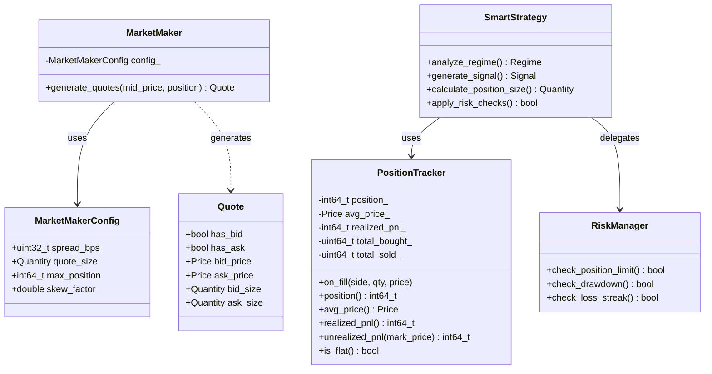
```mermaid
classDiagram
    class PositionTracker {
        -int64_t position_
        -Price avg_price_
        -int64_t realized_pnl_
        -uint64_t total_bought_
        -uint64_t total_sold_
        +on_fill(side, qty, price)
        +position() int64_t
        +avg_price() Price
        +realized_pnl() int64_t
        +unrealized_pnl(mark_price) int64_t
        +is_flat() bool
    }

    class MarketMaker {
        -MarketMakerConfig config_
        +generate_quotes(mid_price, position) Quote
    }

    class MarketMakerConfig {
        +uint32_t spread_bps
        +Quantity quote_size
        +int64_t max_position
        +double skew_factor
    }

    class Quote {
        +bool has_bid
        +bool has_ask
        +Price bid_price
        +Price ask_price
        +Quantity bid_size
        +Quantity ask_size
    }

    class SmartStrategy {
        +analyze_regime() Regime
        +generate_signal() Signal
        +calculate_position_size() Quantity
        +apply_risk_checks() bool
    }

    class RiskManager {
        +check_position_limit() bool
        +check_drawdown() bool
        +check_loss_streak() bool
    }

    MarketMaker --> MarketMakerConfig : uses
    MarketMaker ..> Quote : generates
    SmartStrategy --> PositionTracker : uses
    SmartStrategy --> RiskManager : delegates
```

**Key Constraints:**
- Position tracking is FIFO (First-In-First-Out)
- All P&L calculations in fixed-point (4 decimal places)
- No allocations on fill processing

---

## Module: Metrics

Header-only SIMD-accelerated trade stream metrics library with rolling time windows.

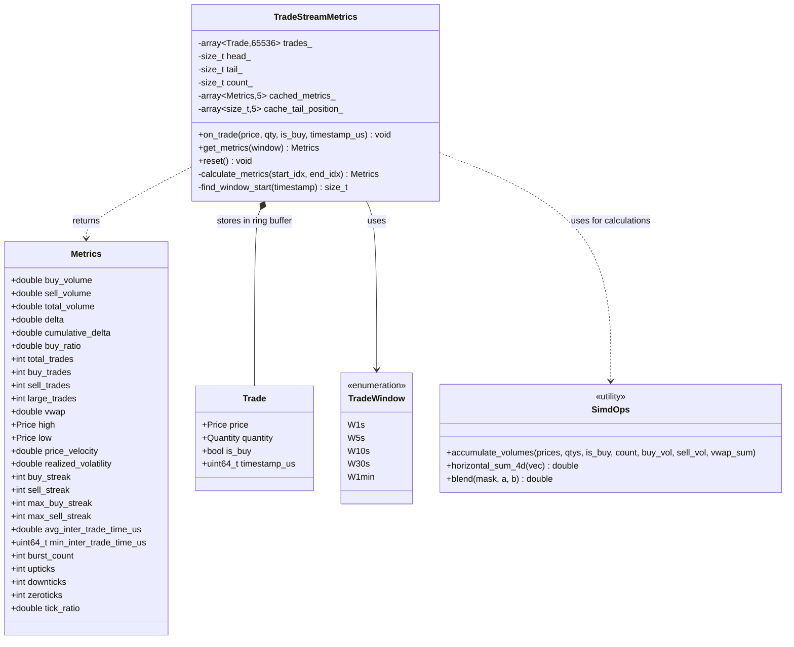
```mermaid
classDiagram
    class TradeStreamMetrics {
        -array~Trade,65536~ trades_
        -size_t head_
        -size_t tail_
        -size_t count_
        -array~Metrics,5~ cached_metrics_
        -array~size_t,5~ cache_tail_position_
        +on_trade(price, qty, is_buy, timestamp_us) void
        +get_metrics(window) Metrics
        +reset() void
        -calculate_metrics(start_idx, end_idx) Metrics
        -find_window_start(timestamp) size_t
    }

    class Metrics {
        +double buy_volume
        +double sell_volume
        +double total_volume
        +double delta
        +double cumulative_delta
        +double buy_ratio
        +int total_trades
        +int buy_trades
        +int sell_trades
        +int large_trades
        +double vwap
        +Price high
        +Price low
        +double price_velocity
        +double realized_volatility
        +int buy_streak
        +int sell_streak
        +int max_buy_streak
        +int max_sell_streak
        +double avg_inter_trade_time_us
        +uint64_t min_inter_trade_time_us
        +int burst_count
        +int upticks
        +int downticks
        +int zeroticks
        +double tick_ratio
    }

    class Trade {
        +Price price
        +Quantity quantity
        +bool is_buy
        +uint64_t timestamp_us
    }

    class TradeWindow {
        <<enumeration>>
        W1s
        W5s
        W10s
        W30s
        W1min
    }

    class SimdOps {
        <<utility>>
        +accumulate_volumes(prices, qtys, is_buy, count, buy_vol, sell_vol, vwap_sum)
        +horizontal_sum_4d(vec) double
        +blend(mask, a, b) double
    }

    TradeStreamMetrics ..> Metrics : returns
    TradeStreamMetrics *-- Trade : stores in ring buffer
    TradeStreamMetrics --> TradeWindow : uses
    TradeStreamMetrics ..> SimdOps : uses for calculations
```

**Metrics (30 metrics × 5 windows = 150 total):**
- **Volume (6):** buy_volume, sell_volume, total_volume, delta, cumulative_delta, buy_ratio
- **Trade count (4):** total_trades, buy_trades, sell_trades, large_trades
- **Price (5):** vwap, high, low, price_velocity, realized_volatility
- **Streaks (4):** buy_streak, sell_streak, max_buy_streak, max_sell_streak
- **Timing (3):** avg_inter_trade_time_us, min_inter_trade_time_us, burst_count
- **Ticks (4):** upticks, downticks, zeroticks, tick_ratio

**Time Windows:**
- 1s, 5s, 10s, 30s, 1min (rolling windows)

**Performance (AVX2):**
- on_trade(): 8.06 ns (branchless ring buffer insertion)
- get_metrics() cache hit: 16.5 ns (cache lookup)
- get_metrics() cache miss: ~8 μs for 1000 trades (SIMD calculation)
- Realistic usage (100 trades + 1 query): 96.6 ns average per trade
- Memory: 1.7 MB (65536 × 26 bytes per trade)

**Optimizations:**
- **Ring buffer:** Power-of-2 size (65536) for fast modulo via bitwise AND
- **SIMD acceleration:** AVX2 processes 4 doubles in parallel (~4x speedup)
- **Lazy caching:** Cache metrics per window, invalidate on new trade
- **Binary search:** O(log n) lookup for window boundaries
- **Branchless code:** Predictable latency (no branch mispredictions)
- **Welford's algorithm:** Online variance calculation (O(1) memory)

**Key Constraints:**
- Header-only (depends on simd library + types.hpp)
- No virtual functions (zero overhead)
- Trades older than 1 minute automatically pruned
- All metrics calculated on-demand with lazy caching
- SIMD backend auto-selected at compile time (AVX-512/AVX2/SSE2/Scalar)

---

### OrderBookMetrics

Real-time order book depth and imbalance metrics for market microstructure analysis.

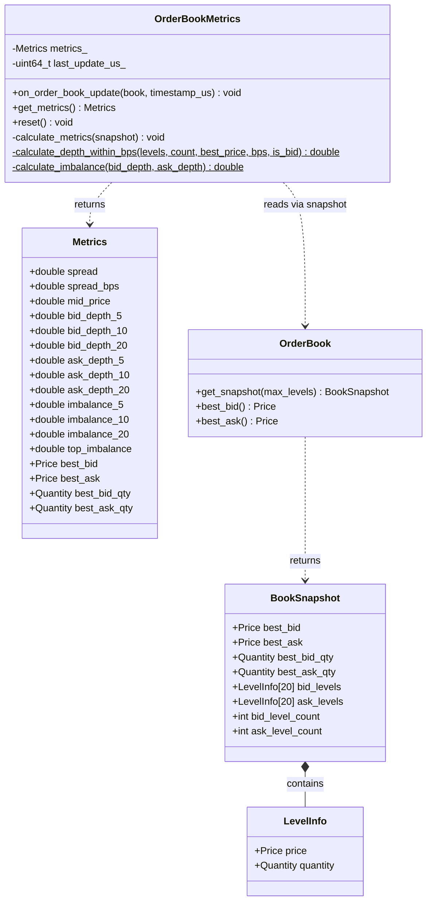
```mermaid
classDiagram
    class OrderBookMetrics {
        -Metrics metrics_
        -uint64_t last_update_us_
        +on_order_book_update(book, timestamp_us) void
        +get_metrics() Metrics
        +reset() void
        -calculate_metrics(snapshot) void
        -calculate_depth_within_bps(levels, count, best_price, bps, is_bid)$ double
        -calculate_imbalance(bid_depth, ask_depth)$ double
    }

    class Metrics {
        +double spread
        +double spread_bps
        +double mid_price
        +double bid_depth_5
        +double bid_depth_10
        +double bid_depth_20
        +double ask_depth_5
        +double ask_depth_10
        +double ask_depth_20
        +double imbalance_5
        +double imbalance_10
        +double imbalance_20
        +double top_imbalance
        +Price best_bid
        +Price best_ask
        +Quantity best_bid_qty
        +Quantity best_ask_qty
    }

    class BookSnapshot {
        +Price best_bid
        +Price best_ask
        +Quantity best_bid_qty
        +Quantity best_ask_qty
        +LevelInfo[20] bid_levels
        +LevelInfo[20] ask_levels
        +int bid_level_count
        +int ask_level_count
    }

    class LevelInfo {
        +Price price
        +Quantity quantity
    }

    class OrderBook {
        +get_snapshot(max_levels) BookSnapshot
        +best_bid() Price
        +best_ask() Price
    }

    OrderBookMetrics ..> Metrics : returns
    OrderBookMetrics ..> OrderBook : reads via snapshot
    OrderBook ..> BookSnapshot : returns
    BookSnapshot *-- LevelInfo : contains
```

**Metrics (17 total):**
- **Spread (3):** spread, spread_bps, mid_price
- **Depth (6):** bid_depth_5, bid_depth_10, bid_depth_20, ask_depth_5, ask_depth_10, ask_depth_20
  - Depth = total quantity within N basis points of best price
  - 5 bps, 10 bps, 20 bps thresholds for each side
- **Imbalance (4):** imbalance_5, imbalance_10, imbalance_20, top_imbalance
  - Imbalance = (bid_depth - ask_depth) / (bid_depth + ask_depth)
  - Ranges from -1 (all asks) to +1 (all bids)
- **Top of Book (4):** best_bid, best_ask, best_bid_qty, best_ask_qty

**Performance:**
- on_order_book_update(): ~42 ns (100x better than 5 μs target)
- get_snapshot(): O(N) where N = max_levels (typically 20)
- calculate_depth_within_bps(): Single pass through sorted levels
- Zero allocations (fixed-size arrays)

**Data Flow:**
1. OrderBook::get_snapshot() extracts top 20 levels (bid/ask)
2. OrderBookMetrics::calculate_metrics() computes all 17 metrics
3. Depth calculation: Single pass per side with 3 bps thresholds
4. Imbalance: Simple ratio calculation from depth values

**Key Constraints:**
- Header-only (depends only on orderbook.hpp + types.hpp)
- No virtual functions (zero overhead)
- Fixed-size snapshot (no allocation)
- Snapshot extraction via template iteration over BookSide levels

---

### OrderFlowMetrics

Real-time order book flow and change metrics for tracking book dynamics and cancel/fill estimation.

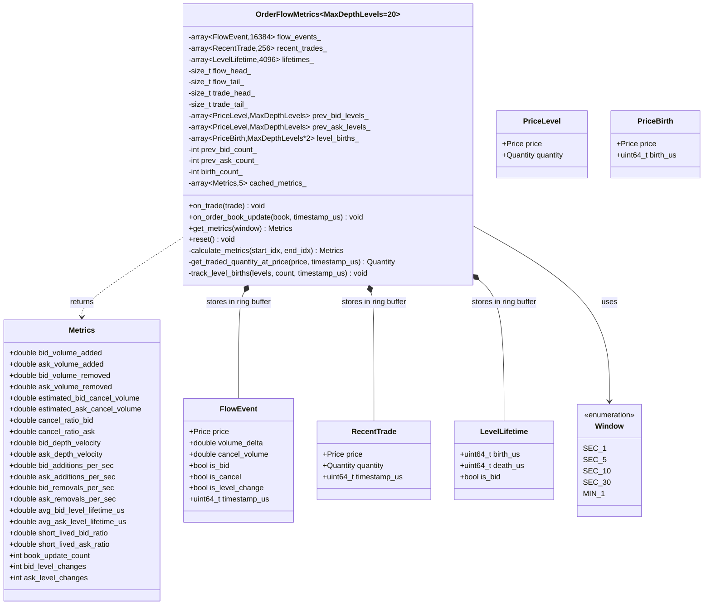
```mermaid
classDiagram
    class OrderFlowMetrics~MaxDepthLevels=20~ {
        -array~FlowEvent,16384~ flow_events_
        -array~RecentTrade,256~ recent_trades_
        -array~LevelLifetime,4096~ lifetimes_
        -size_t flow_head_
        -size_t flow_tail_
        -size_t trade_head_
        -size_t trade_tail_
        -array~PriceLevel,MaxDepthLevels~ prev_bid_levels_
        -array~PriceLevel,MaxDepthLevels~ prev_ask_levels_
        -array~PriceBirth,MaxDepthLevels*2~ level_births_
        -int prev_bid_count_
        -int prev_ask_count_
        -int birth_count_
        -array~Metrics,5~ cached_metrics_
        +on_trade(trade) void
        +on_order_book_update(book, timestamp_us) void
        +get_metrics(window) Metrics
        +reset() void
        -calculate_metrics(start_idx, end_idx) Metrics
        -get_traded_quantity_at_price(price, timestamp_us) Quantity
        -track_level_births(levels, count, timestamp_us) void
    }

    class Metrics {
        +double bid_volume_added
        +double ask_volume_added
        +double bid_volume_removed
        +double ask_volume_removed
        +double estimated_bid_cancel_volume
        +double estimated_ask_cancel_volume
        +double cancel_ratio_bid
        +double cancel_ratio_ask
        +double bid_depth_velocity
        +double ask_depth_velocity
        +double bid_additions_per_sec
        +double ask_additions_per_sec
        +double bid_removals_per_sec
        +double ask_removals_per_sec
        +double avg_bid_level_lifetime_us
        +double avg_ask_level_lifetime_us
        +double short_lived_bid_ratio
        +double short_lived_ask_ratio
        +int book_update_count
        +int bid_level_changes
        +int ask_level_changes
    }

    class FlowEvent {
        +Price price
        +double volume_delta
        +double cancel_volume
        +bool is_bid
        +bool is_cancel
        +bool is_level_change
        +uint64_t timestamp_us
    }

    class RecentTrade {
        +Price price
        +Quantity quantity
        +uint64_t timestamp_us
    }

    class LevelLifetime {
        +uint64_t birth_us
        +uint64_t death_us
        +bool is_bid
    }

    class PriceLevel {
        +Price price
        +Quantity quantity
    }

    class PriceBirth {
        +Price price
        +uint64_t birth_us
    }

    class Window {
        <<enumeration>>
        SEC_1
        SEC_5
        SEC_10
        SEC_30
        MIN_1
    }

    OrderFlowMetrics ..> Metrics : returns
    OrderFlowMetrics *-- FlowEvent : stores in ring buffer
    OrderFlowMetrics *-- RecentTrade : stores in ring buffer
    OrderFlowMetrics *-- LevelLifetime : stores in ring buffer
    OrderFlowMetrics --> Window : uses
```

**Metrics (21 metrics × 5 windows = 105 total):**
- **Added/Removed Volume (4):** bid_volume_added, ask_volume_added, bid_volume_removed, ask_volume_removed
  - Tracks volume changes at each price level
  - Positive delta = added, negative delta = removed
- **Cancel Estimation (4):** estimated_bid_cancel_volume, estimated_ask_cancel_volume, cancel_ratio_bid, cancel_ratio_ask
  - Correlates book changes with trades (100ms window)
  - No trade at price → cancel, trade at price → fill
- **Book Velocity (6):** bid_depth_velocity, ask_depth_velocity, bid_additions_per_sec, ask_additions_per_sec, bid_removals_per_sec, ask_removals_per_sec
  - Rate of depth change (volume per second)
  - Event frequency (additions/removals per second)
- **Level Lifetime (4):** avg_bid_level_lifetime_us, avg_ask_level_lifetime_us, short_lived_bid_ratio, short_lived_ask_ratio
  - Tracks how long levels survive in the book
  - Short-lived = < 1 second
- **Update Frequency (3):** book_update_count, bid_level_changes, ask_level_changes

**Time Windows:**
- 1s, 5s, 10s, 30s, 1min (rolling windows)

**Performance:**
- on_trade(): < 100 ns (append to trade ring buffer)
- on_order_book_update(): < 5 μs (SIMD-optimized level extraction + delta comparison)
- get_metrics() cache hit: < 1 μs (cache lookup)
- get_metrics() cache miss: < 5 μs (single-pass branchless calculation)
- Memory: ~1.2 MB (pre-allocated ring buffers + fixed-size arrays)

**Data Flow:**
1. on_order_book_update() extracts current book state via snapshot
2. SIMD-optimized level extraction: copy levels + calculate depth (single pass)
3. Track level births using SIMD iterator (architecture-aware vectorization)
4. Compare current vs previous state (stored in flat arrays, O(n) linear search)
5. Detect changes: new levels, removed levels, quantity changes
6. For removals: check recent_trades_ (100ms correlation window)
   - Trade at price within 100ms → fill
   - No trade at price → cancel
7. Generate FlowEvent for each change
8. Track level lifetimes (birth to death)
9. Ring buffers auto-prune events older than 1 minute

**Optimizations:**
- **Ring buffers:** Power-of-2 sizes for fast modulo via bitwise AND
- **SIMD iterators:** Uses `simd::for_each_step` for architecture-aware vectorization (AVX-512/AVX2/SSE2)
- **Flat arrays:** Previous book state stored in fixed-size arrays (cache-friendly, O(n) linear search)
- **Branchless accumulation:** Uses sign arithmetic and comparison masks
- **Single-pass calculation:** One traversal computes all metrics
- **Lambda reuse:** Local lambdas for extract_levels (DRY, following Rule of Three)
- **Lazy caching:** Cache metrics per window, invalidate on new event
- **Pre-allocation:** Fixed-size buffers, no heap allocation after warmup

**Key Constraints:**
- Header-only (depends on orderbook.hpp + ipc/trade_event.hpp + types.hpp)
- No virtual functions (zero overhead)
- Events older than 1 minute automatically pruned
- Cancel/fill correlation window: 100ms
- Short-lived level threshold: 1 second

---

### SIMD Utility Library

Automatic vectorization backend for performance-critical numeric operations.

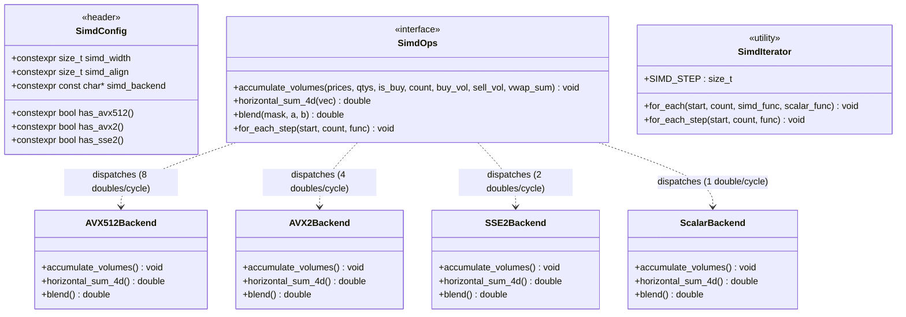
```mermaid
classDiagram
    class SimdConfig {
        <<header>>
        +constexpr size_t simd_width
        +constexpr size_t simd_align
        +constexpr const char* simd_backend
        +constexpr bool has_avx512()
        +constexpr bool has_avx2()
        +constexpr bool has_sse2()
    }

    class SimdOps {
        <<interface>>
        +accumulate_volumes(prices, qtys, is_buy, count, buy_vol, sell_vol, vwap_sum) void
        +horizontal_sum_4d(vec) double
        +blend(mask, a, b) double
        +for_each_step(start, count, func) void
    }

    class SimdIterator {
        <<utility>>
        +SIMD_STEP : size_t
        +for_each(start, count, simd_func, scalar_func) void
        +for_each_step(start, count, func) void
    }

    class AVX512Backend {
        +accumulate_volumes() void
        +horizontal_sum_4d() double
        +blend() double
    }

    class AVX2Backend {
        +accumulate_volumes() void
        +horizontal_sum_4d() double
        +blend() double
    }

    class SSE2Backend {
        +accumulate_volumes() void
        +horizontal_sum_4d() double
        +blend() double
    }

    class ScalarBackend {
        +accumulate_volumes() void
        +horizontal_sum_4d() double
        +blend() double
    }

    SimdOps ..> AVX512Backend : dispatches (8 doubles/cycle)
    SimdOps ..> AVX2Backend : dispatches (4 doubles/cycle)
    SimdOps ..> SSE2Backend : dispatches (2 doubles/cycle)
    SimdOps ..> ScalarBackend : dispatches (1 double/cycle)
```

**Backend Selection (Compile-time):**
1. AVX-512 (if `-mavx512f -mavx512dq`): 8 doubles/cycle, ~8x speedup
2. AVX2 (if `-mavx2`): 4 doubles/cycle, ~4x speedup (default with `-march=native`)
3. SSE2 (if `-msse2`): 2 doubles/cycle, ~2x speedup
4. Scalar (fallback): 1 double/cycle

**Performance (1000 elements, AVX2):**
- accumulate_volumes(): 304 ns (~3.3M iterations/sec)
- 4x faster than scalar implementation
- Zero overhead abstraction (inlined)

**SIMD Iterators:**

Generic loop iterator with architecture-aware step sizes and early exit support:

```cpp
// Basic usage: process SIMD_STEP elements at a time
simd::for_each_step(0, count, [&](size_t i, size_t step) {
    for (size_t j = 0; j < step; j++) {
        process(data[i + j]);
    }
    return true;  // Continue iteration
});
```

**Features:**
- Auto-detects SIMD width (8 for AVX-512, 4 for AVX2, 2 for SSE2, 1 for scalar)
- Handles remainder elements with scalar loop (no manual tail handling)
- Early exit support (return false to break)
- Zero overhead (fully inlined with `__attribute__((always_inline))`)

**Used by:**
- `OrderFlowMetrics::track_level_births()` - Birth timestamp tracking
- `OrderFlowMetrics::extract_levels()` - Level extraction + depth calculation

---

## Module: IPC

Lock-free shared memory for inter-process communication.

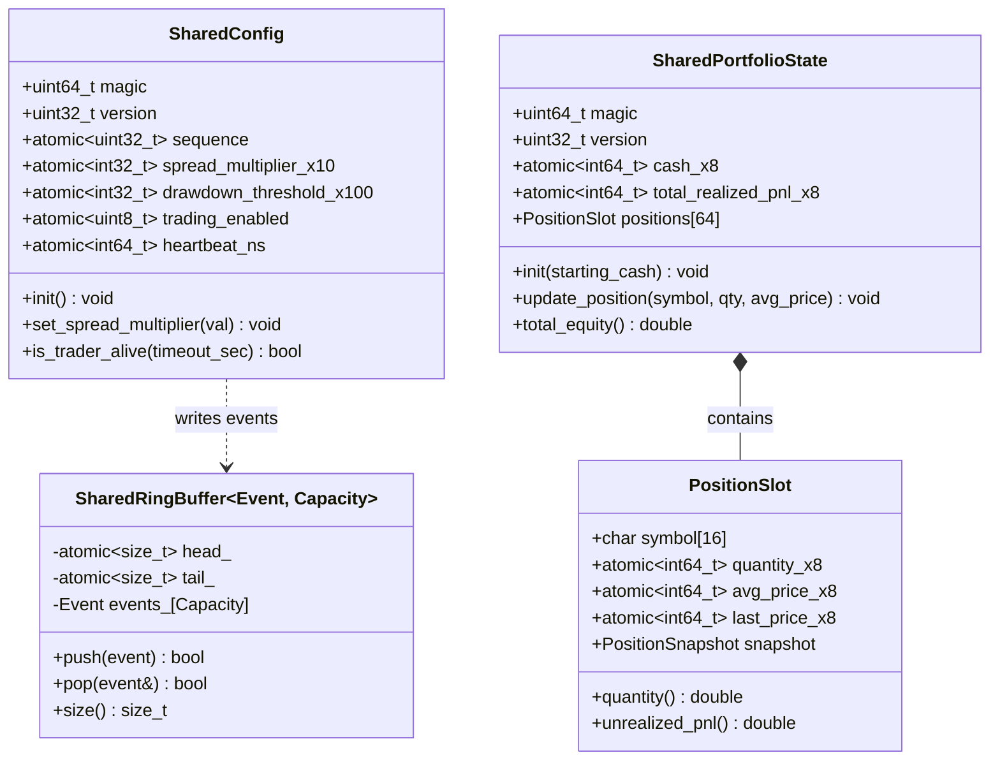
```mermaid
classDiagram
    class SharedConfig {
        +uint64_t magic
        +uint32_t version
        +atomic~uint32_t~ sequence
        +atomic~int32_t~ spread_multiplier_x10
        +atomic~int32_t~ drawdown_threshold_x100
        +atomic~uint8_t~ trading_enabled
        +atomic~int64_t~ heartbeat_ns
        +init() void
        +set_spread_multiplier(val) void
        +is_trader_alive(timeout_sec) bool
    }

    class SharedPortfolioState {
        +uint64_t magic
        +uint32_t version
        +atomic~int64_t~ cash_x8
        +atomic~int64_t~ total_realized_pnl_x8
        +PositionSlot positions[64]
        +init(starting_cash) void
        +update_position(symbol, qty, avg_price) void
        +total_equity() double
    }

    class PositionSlot {
        +char symbol[16]
        +atomic~int64_t~ quantity_x8
        +atomic~int64_t~ avg_price_x8
        +atomic~int64_t~ last_price_x8
        +PositionSnapshot snapshot
        +quantity() double
        +unrealized_pnl() double
    }

    class SharedRingBuffer~Event, Capacity~ {
        -atomic~size_t~ head_
        -atomic~size_t~ tail_
        -Event events_[Capacity]
        +push(event) bool
        +pop(event&) bool
        +size() size_t
    }

    SharedPortfolioState *-- PositionSlot : contains
    SharedConfig ..> SharedRingBuffer : writes events
```

**Memory Ordering:**
- Single-writer fields: `memory_order_relaxed`
- Cross-thread sync: `acquire/release`
- Price updates: < 5 cycles (relaxed)
- Position updates: < 10 cycles (relaxed)
- Heartbeat: < 100 cycles

**Testing Requirement:**
Any IPC struct change must be tested with all consumers running:
1. Terminal 1: `./trader --paper`
2. Terminal 2: `./trader_dashboard`
3. Terminal 3: `./trader_observer`

---

## Sequence Diagram: Market Data Flow

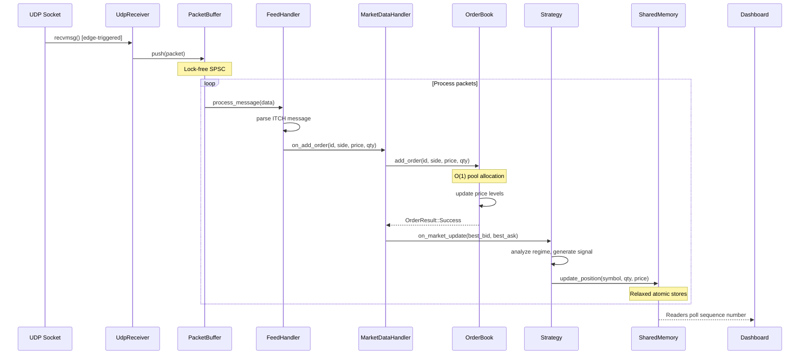
```mermaid
sequenceDiagram
    participant UDP as UDP Socket
    participant Recv as UdpReceiver
    participant Buf as PacketBuffer
    participant Feed as FeedHandler
    participant MD as MarketDataHandler
    participant Book as OrderBook
    participant Strat as Strategy
    participant IPC as SharedMemory

    UDP->>Recv: recvmsg() [edge-triggered]
    Recv->>Buf: push(packet)
    Note over Buf: Lock-free SPSC

    loop Process packets
        Buf->>Feed: process_message(data)
        Feed->>Feed: parse ITCH message
        Feed->>MD: on_add_order(id, side, price, qty)
        MD->>Book: add_order(id, side, price, qty)
        Note over Book: O(1) pool allocation
        Book->>Book: update price levels
        Book-->>MD: OrderResult::Success
        MD->>Strat: on_market_update(best_bid, best_ask)
        Strat->>Strat: analyze regime, generate signal
        Strat->>IPC: update_position(symbol, qty, price)
        Note over IPC: Relaxed atomic stores
    end

    IPC-->>Dashboard: Readers poll sequence number
```

---

## Dependency Map

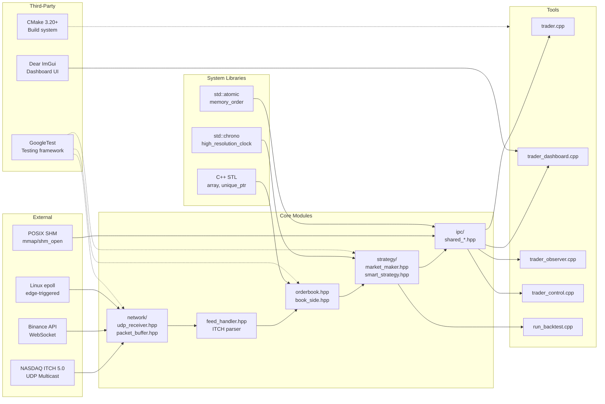
```mermaid
flowchart LR
    subgraph External
        ITCH[NASDAQ ITCH 5.0<br/>UDP Multicast]
        Binance[Binance API<br/>WebSocket]
        POSIX[POSIX SHM<br/>mmap/shm_open]
        Linux[Linux epoll<br/>edge-triggered]
    end

    subgraph System Libraries
        STL[C++ STL<br/>array, unique_ptr]
        Atomic[std::atomic<br/>memory_order]
        Chrono[std::chrono<br/>high_resolution_clock]
    end

    subgraph Third-Party
        ImGui[Dear ImGui<br/>Dashboard UI]
        CMake[CMake 3.20+<br/>Build system]
        GoogleTest[GoogleTest<br/>Testing framework]
    end

    subgraph Core Modules
        Network[network/<br/>udp_receiver.hpp<br/>packet_buffer.hpp]
        Feed[feed_handler.hpp<br/>ITCH parser]
        Book[orderbook.hpp<br/>book_side.hpp]
        Strategy[strategy/<br/>market_maker.hpp<br/>smart_strategy.hpp]
        IPC[ipc/<br/>shared_*.hpp]
    end

    subgraph Tools
        Trader[trader.cpp]
        Dashboard[trader_dashboard.cpp]
        Observer[trader_observer.cpp]
        Control[trader_control.cpp]
        Backtest[run_backtest.cpp]
    end

    ITCH --> Network
    Binance --> Network
    Linux --> Network
    Network --> Feed
    Feed --> Book
    Book --> Strategy
    Strategy --> IPC
    POSIX --> IPC
    Atomic --> IPC
    STL --> Book
    Chrono --> Strategy

    IPC --> Trader
    IPC --> Dashboard
    IPC --> Observer
    IPC --> Control
    Strategy --> Backtest

    ImGui --> Dashboard
    CMake -.-> Tools
    GoogleTest -.-> Network
    GoogleTest -.-> Book
    GoogleTest -.-> Strategy
```

**External Dependencies:**
- NASDAQ ITCH 5.0 specification
- Binance WebSocket API (market data + user data streams)
- Linux kernel 3.9+ (epoll, shm_open, mmap)

**Build Requirements:**
- C++20 compiler (GCC 11+ or Clang 14+)
- CMake 3.20+
- POSIX-compliant OS (Linux, macOS)

**Third-Party Libraries:**
- Dear ImGui (dashboard UI, vendored)
- GoogleTest (testing, fetched by CMake)

---

## CI/CD Pipeline

### GitHub Actions Workflows

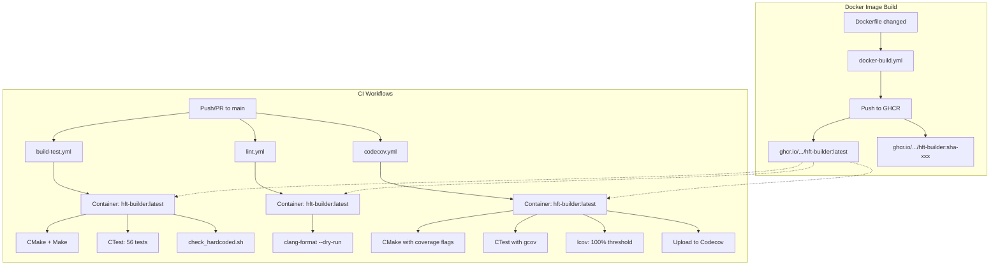
```mermaid
flowchart TD
    subgraph Docker Image Build
        DockerChange[Dockerfile changed] --> DockerBuild[docker-build.yml]
        DockerBuild --> GHCR[Push to GHCR]
        GHCR --> LatestTag[ghcr.io/.../hft-builder:latest]
        GHCR --> SHATag[ghcr.io/.../hft-builder:sha-xxx]
    end

    subgraph CI Workflows
        PushPR[Push/PR to main] --> BuildTest[build-test.yml]
        PushPR --> Lint[lint.yml]
        PushPR --> Coverage[codecov.yml]

        BuildTest --> Container1[Container: hft-builder:latest]
        Lint --> Container2[Container: hft-builder:latest]
        Coverage --> Container3[Container: hft-builder:latest]

        Container1 --> Build[CMake + Make]
        Container1 --> Test[CTest: 56 tests]
        Container1 --> MagicCheck[check_hardcoded.sh]

        Container2 --> FormatCheck[clang-format --dry-run]

        Container3 --> BuildCov[CMake with coverage flags]
        Container3 --> TestCov[CTest with gcov]
        Container3 --> Report[lcov: 100% threshold]
        Container3 --> Upload[Upload to Codecov]
    end

    LatestTag -.-> Container1
    LatestTag -.-> Container2
    LatestTag -.-> Container3
```

### Docker Builder Image

**Image:** `ghcr.io/orhanveliesen/hft-builder:latest`
**Base:** Ubuntu 22.04
**Pre-installed:**
- Build tools: cmake, build-essential (GCC 11)
- Dependencies: libwebsockets-dev, libglfw3-dev, libgl1-mesa-dev, libcurl4-openssl-dev
- Linting: clang-format
- Coverage: lcov, gcov
- Version control: git (for CMake commit hash)

**Performance Impact:**
- Before (apt install): 30-60s per workflow
- After (container pull): 2-5s per workflow
- **20-30x faster** dependency setup

### Workflow Dependencies

| Workflow | Container | Key Steps | Output |
|----------|-----------|-----------|--------|
| build-test.yml | hft-builder:latest | CMake Release build, 56 tests, magic number check | Build artifacts |
| lint.yml | hft-builder:latest | clang-format check | Pass/fail |
| codecov.yml | hft-builder:latest | Debug build with coverage, lcov report, 100% check | Coverage report |
| docker-build.yml | N/A | Build and push builder image | GHCR package |

### Coverage Enforcement

**100% line coverage required** (strict):
- Tool: lcov + gcov
- Exclusions: `/usr/*`, `*/external/*`, `*/tests/*`

### Coverage Policy

**Source Code Annotations: FORBIDDEN**
- `LCOV_EXCL_LINE`, `LCOV_EXCL_START`, `LCOV_EXCL_STOP` in source code: **NEVER**
- All production code must have real test coverage
- Use inheritance-based mocks or template policy for testability

**lcov Filter (Tool Config): ALLOWED**
- `lcov --remove` patterns in CI/pre-commit: **ALLOWED**
- Only for:
  - libwebsockets callbacks (untestable without real server)
  - Third-party library wrappers (network I/O)
- Pattern example: `*/exchange/*lws*`

**Rationale:** Source code stays clean. Tool config explicitly documents what's excluded and why.

### Local Development with Docker

```bash
# Pull latest builder image
docker pull ghcr.io/orhanveliesen/hft-builder:latest

# Build project
docker run --rm -v $(pwd):/workspace ghcr.io/orhanveliesen/hft-builder:latest \
  bash -c "mkdir -p build && cd build && cmake -DCMAKE_BUILD_TYPE=Release .. && make -j$(nproc)"

# Run tests
docker run --rm -v $(pwd):/workspace ghcr.io/orhanveliesen/hft-builder:latest \
  bash -c "cd build && ctest --output-on-failure"

# Format code
docker run --rm -v $(pwd):/workspace ghcr.io/orhanveliesen/hft-builder:latest \
  bash -c "find include tools tests benchmarks -type f \( -name '*.cpp' -o -name '*.hpp' \) -exec clang-format -i {} +"
```

---

## Hot Path Files

These files are on the critical latency path. Benchmark before/after changes.

| File | Impact | Benchmark |
|------|--------|-----------|
| `include/orderbook.hpp` | Order operations | `./bench_orderbook` |
| `include/feed_handler.hpp` | Message parsing | `./bench_feed_handler` |
| `include/network/packet_buffer.hpp` | Packet buffering | `./bench_packet_buffer` |
| `include/strategy/market_maker.hpp` | Quote generation | N/A (unit test timing) |
| `include/ipc/shared_portfolio_state.hpp` | IPC updates | `./bench_ipc` |

**Performance Regression = Immediate Revert**

Run benchmarks:
```bash
cd build
./bench_orderbook
./bench_feed_handler
./bench_packet_buffer
./bench_ipc
```

---

## Entry Points

### Production
- `tools/trader.cpp` - Main trading engine (paper/live)
  - Connects to UDP/WebSocket feeds
  - Runs strategies
  - Publishes to IPC

### Monitoring
- `tools/trader_dashboard.cpp` - Real-time ImGui dashboard
  - Reads IPC (portfolio state, config, events)
  - Displays P&L, positions, charts
  - Allows runtime config changes

- `tools/trader_observer.cpp` - CLI event monitor
  - Tails IPC event stream
  - Prints trade/tuner events to stdout

### Control
- `tools/trader_control.cpp` - Runtime parameter control
  - Writes to SharedConfig
  - Triggers manual tuning
  - Enables/disables trading

### Research
- `tools/run_backtest.cpp` - Historical backtesting
  - Replays kline data
  - Tests strategy performance

- `tools/optimize_strategies.cpp` - Parameter optimization
  - Grid search / genetic algorithm
  - Maximizes Sharpe ratio

- `tools/trader_tuner.cpp` - AI parameter tuning
  - Watches live performance
  - Adjusts strategy params dynamically

---

## Data Flow Summary

1. **Ingestion:** UDP/WebSocket → UdpReceiver → PacketBuffer (lock-free ring)
2. **Parsing:** FeedHandler (template) → MarketDataHandler (adapter)
3. **Market Data:** OrderBook (pre-allocated pools, O(1) ops)
4. **Strategy:** MarketMaker/SmartStrategy (regime analysis, signal generation)
5. **Risk:** RiskManager (position limits, drawdown, loss streak)
6. **IPC:** SharedMemory (relaxed atomics, < 10 cycles)
7. **Monitoring:** Dashboard/Observer (read-only consumers)

**Latency Budget:**
- Network to OrderBook update: < 10 μs
- OrderBook update to strategy signal: < 5 μs
- Strategy signal to IPC write: < 1 μs
- **Total (tick-to-signal): < 20 μs**

---

## Project Structure

```
include/
├── network/
│   ├── udp_receiver.hpp         # UDP multicast + epoll
│   └── packet_buffer.hpp        # Lock-free SPSC ring
├── feed_handler.hpp             # Template-based ITCH parser
├── market_data_handler.hpp      # Callback adapter
├── orderbook.hpp                # Pre-allocated pool-based book
├── book_side.hpp                # Bid/Ask side (template)
├── metrics/
│   └── trade_stream_metrics.hpp # Trade stream metrics (30 metrics × 5 windows)
├── strategy/
│   ├── position.hpp             # Position tracker (FIFO)
│   ├── market_maker.hpp         # Market making strategy
│   ├── smart_strategy.hpp       # Regime-based adaptive strategy
│   └── risk_manager.hpp         # Risk checks
├── ipc/
│   ├── shared_config.hpp        # Runtime config (bidirectional)
│   ├── shared_portfolio_state.hpp # Portfolio snapshot
│   ├── shared_ring_buffer.hpp   # Event stream (SPSC)
│   └── trade_event.hpp          # Event types
└── types.hpp                    # Core types (Price, Quantity, Side)

tools/
├── trader.cpp                   # Main trading engine
├── trader_dashboard.cpp         # ImGui dashboard
├── trader_observer.cpp          # CLI event monitor
├── trader_control.cpp           # Runtime control
├── trader_tuner.cpp             # AI parameter tuning
├── run_backtest.cpp             # Backtesting engine
└── optimize_strategies.cpp      # Parameter optimizer

tests/                           # 57 test suites (including 34 metrics tests)
benchmarks/                      # Performance benchmarks
├── bench_orderbook.cpp          # OrderBook performance
├── bench_lockfree.cpp           # Lock-free buffer performance
└── bench_trade_stream_metrics.cpp # Metrics performance
```

---

## Module: Event-Driven Architecture (Phase 5.0)

### Overview
Event-driven refactor of trader.cpp into clean, testable components with synchronous publish-subscribe pattern.

**Data Flow:**
```
WS → MetricsManager (direct calls)
  ↓
update metrics + regime + shared memory
  ↓
threshold crossed? → callback
  ↓
StrategyEvaluator.evaluate()
  ↓
EventBus.publish(ActionEvent)
  ↓
Subscribers (SpotEngine, LimitManager) → execute
```

### Components

#### 1. EventBus (`include/core/event_bus.hpp`)
Synchronous type-erased publish-subscribe system for action events.

**Design:**
- Template-based subscription: `subscribe<EventType>(callback)`
- Type-erased storage using `std::type_index` + `std::function<void(const void*)>`
- Synchronous execution (no queues, no threads)
- Zero allocation on publish (pre-allocated handler vectors)

**Usage:**
```cpp
core::EventBus bus;

// Subscribe
bus.subscribe<SpotBuyEvent>([&](const SpotBuyEvent& e) {
    spot_engine.execute(create_order_request(e));
});

// Publish
bus.publish(SpotBuyEvent{.symbol = 0, .qty = 1.0, .strength = 1.0});
```

**Performance:** < 100 ns per publish (tested with 10K events)

#### 2. Events (`include/core/events.hpp`)
9 action event types (NOT data events - those use direct calls):

**Spot Events:**
- `SpotBuyEvent` - Market buy signal
- `SpotSellEvent` - Market sell signal
- `SpotLimitBuyEvent` - Limit buy signal (includes exec_score)
- `SpotLimitSellEvent` - Limit sell signal (includes exec_score)

**Futures Events (Phase 5.1):**
- `FuturesBuyEvent` - Open long
- `FuturesSellEvent` - Open short
- `FuturesCloseLongEvent` - Close long position
- `FuturesCloseShortEvent` - Close short position

**Lifecycle Events:**
- `LimitCancelEvent` - Cancel pending limit (timeout or manual)

**Common Fields:**
```cpp
struct SpotBuyEvent {
    Symbol symbol;
    Quantity qty;
    double strength;        // Signal strength [0.0, 1.0]
    const char* reason;     // Signal reason (static string)
    uint64_t timestamp_ns;
};
```

#### 3. MetricsManager (`include/core/metrics_manager.hpp`)
Central coordinator for all metrics (~1700 lines including inline implementations).

**Owned Metrics Arrays (MAX_SYMBOLS = 64):**
- `TradeStreamMetrics[64]` - Trade flow, volume, volatility
- `OrderBookMetrics[64]` - Spread, imbalance, depth
- `OrderFlowMetrics<20>[64]` - Aggressor flow, VPIN
- `CombinedMetrics[64]` - Composite metrics
- `FuturesMetrics[64]` - Funding rate, basis, liquidations
- `RegimeDetector[64]` - Market regime classification

**Responsibilities:**
1. Update metrics from WS feeds (direct calls, no events)
2. Update RegimeDetector on every quote
3. Write SharedMetricsSnapshot for tuner/ML
4. Check thresholds → fire change callback
5. Provide MetricsContext for strategy evaluation

**Threshold Logic:**
```cpp
struct MetricsThresholds {
    double spread_bps = 0.1;        // Near-zero defaults
    double buy_ratio = 0.01;        // Trigger on almost every real change
    double basis_bps = 0.5;
    double funding_rate = 0.00001;
    double volatility = 0.001;
    double top_imbalance = 0.02;
};
```

**Change Callback:**
```cpp
metrics.set_change_callback([&](Symbol id) {
    evaluator.evaluate(id, market, position);  // Trigger strategy evaluation
});
```

**API:**
```cpp
void on_trade(Symbol, double price, int qty, bool is_buy, uint64_t ts_us);
void on_depth(Symbol, const BookSnapshot&, uint64_t ts_us);
void on_mark_price(Symbol, double mark, double index, double funding, ...);
void on_liquidation(Symbol, Side, double price, double qty, ...);

MetricsContext context_for(Symbol id) const;  // Returns filled context
```

**Performance:** < 5 μs per on_trade() call (includes threshold check + snapshot write)

#### 4. SharedMetricsSnapshot (`include/ipc/shared_metrics_snapshot.hpp`)
Shared memory snapshot of ALL computed metrics for tuner/ML (~326 atomic fields per symbol).

**Structure:**
```cpp
struct SymbolMetricsSnapshot {
    char ticker[16];

    // TradeStreamMetrics (25 fields × 5 windows = 125)
    std::atomic<int64_t> trade_w1s_buy_volume_x8;
    std::atomic<int64_t> trade_w1s_sell_volume_x8;
    // ... 123 more trade fields

    // OrderBookMetrics (17 fields × 1 = 17)
    std::atomic<int64_t> book_current_spread_bps_x8;
    std::atomic<int64_t> book_current_top_imbalance_x8;
    // ... 15 more book fields

    // OrderFlowMetrics (21 fields × 4 windows = 84)
    std::atomic<int64_t> flow_sec1_vpin_x8;
    std::atomic<int64_t> flow_sec1_aggressor_ratio_x8;
    // ... 82 more flow fields

    // CombinedMetrics (7 fields × 5 windows = 35)
    std::atomic<int64_t> combined_sec1_momentum_score_x8;
    // ... 34 more combined fields

    // FuturesMetrics (11 fields × 5 windows + 1 = 56)
    std::atomic<int64_t> futures_w1s_funding_rate_x8;
    std::atomic<int64_t> futures_w1s_basis_bps_x8;
    // ... 54 more futures fields

    // Regime (4 fields)
    std::atomic<uint8_t> regime;
    std::atomic<int64_t> regime_current_confidence_x8;
    // ... 2 more regime fields

    std::atomic<uint64_t> update_count;
    std::atomic<uint64_t> last_update_ns;
};

struct SharedMetricsSnapshot {
    static constexpr uint32_t MAGIC = 0x4D455452;  // "METR"
    static constexpr uint32_t VERSION = 1;

    uint32_t magic;
    uint32_t version;
    SymbolMetricsSnapshot symbols[64];

    static SharedMetricsSnapshot* create();
    static SharedMetricsSnapshot* open_readonly();
    static void destroy();
};
```

**Memory Layout:**
- Fixed-point encoding (x8 = multiply by 256 for 8 bits of fractional precision)
- Relaxed memory order (single writer, multiple readers)
- Magic + version for validation
- ~80 KB per symbol × 64 symbols = ~5 MB total

**Tuner Integration (Future - Issue #1):**
```cpp
// Tuner process (separate executable)
auto* snap = SharedMetricsSnapshot::open_readonly();
while (running) {
    for (Symbol id : active_symbols) {
        auto& sym = snap->symbols[id];
        // Read ALL 326 fields, batch insert to ClickHouse
        // At 1 row/symbol/sec, 10 symbols = 864K rows/day
    }
    sleep(1);
}
```

#### 5. StrategyEvaluator (`include/core/strategy_evaluator.hpp`)
Evaluates strategy signals and publishes action events.

**Flow:**
```
1. Get MetricsContext from MetricsManager
2. Get active strategy from StrategySelector
3. Call strategy.generate()
4. Compute execution score (ExecutionScorer)
5. Publish Market or Limit event based on score
6. Check pending limits for timeout if no signal
```

**Implementation:**
```cpp
void evaluate(Symbol id, const MarketSnapshot& market, const StrategyPosition& pos) {
    auto ctx = metrics_->context_for(id);
    auto* strategy = selector_->select_for_regime(ctx.regime);

    Signal signal = strategy->generate(id, market, pos, ctx.regime, &ctx);

    if (!signal.is_actionable()) {
        limit_mgr_->check_timeouts();  // No action, check pending limits
        return;
    }

    if (is_dangerous_regime(ctx.regime)) {
        return;  // Don't trade in Spike or HighVolatility
    }

    auto score = ExecutionScorer::compute(signal, &ctx, signal.is_buy() ? Side::Buy : Side::Sell);

    if (score.prefer_limit()) {
        // Publish limit event
        bus_->publish(SpotLimitBuyEvent{...});
    } else {
        // Publish market event
        bus_->publish(SpotBuyEvent{...});
    }
}
```

**Dangerous Regimes:**
- `MarketRegime::Spike` - No trading (flash crash protection)
- `MarketRegime::HighVolatility` - No trading (avoid slippage)

**Signal Strength Conversion:**
```cpp
SignalStrength::Weak   → 0.33
SignalStrength::Medium → 0.66
SignalStrength::Strong → 1.0
```

#### 6. TradingEngine<Venue> (`include/execution/trading_engine.hpp`)
Template-based execution engine with compile-time Spot/Futures differentiation.

**Design:**
```cpp
enum class Venue { Spot, Futures };

template <Venue V>
class TradingEngine {
    uint64_t execute(const OrderRequest& req, const MarketSnapshot& market) {
        // Position check ONLY for Spot venue
        if constexpr (V == Venue::Spot) {
            if (req.side == Side::Sell) {
                double pos = get_position_(req.symbol);
                if (pos < MIN_POSITION_THRESHOLD) return 0;  // No position
                if (req.qty > pos) req.qty = pos;  // Limit qty
            }
        }
        // Futures: No position check (can have both long + short)

        return exchange_->send_order(...);
    }

    void cancel_stale_orders(uint64_t current_time_ns);
    void recover_stuck_orders();  // From PR #60 - fault-tolerant cancellation
};

using SpotEngine = TradingEngine<Venue::Spot>;
using FuturesEngine = TradingEngine<Venue::Futures>;
```

**Compile-Time Optimization:**
- `if constexpr` branches are eliminated at compile time
- SpotEngine binary contains NO position check code path for futures
- FuturesEngine binary contains NO position check at all
- Zero runtime overhead vs hand-written specialized classes

**Stuck Order Recovery (PR #60):**
```cpp
void recover_stuck_orders() {
    for (auto& pending : pending_cancels_) {
        if (pending.state == CancelState::AwaitingConfirm) {
            uint64_t elapsed_ns = now_ns() - pending.submit_time_ns;
            if (elapsed_ns > STUCK_THRESHOLD_NS) {
                // Retry cancel
                pending.state = CancelState::Retrying;
                exchange_->cancel_order(pending.order_id);
            }
        }
    }
}
```

#### 7. LimitManager (`include/execution/limit_manager.hpp`)
Event-driven limit order lifecycle manager.

**Responsibilities:**
1. Track pending limit orders
2. Check timeouts (called from heartbeat loop)
3. Publish LimitCancelEvent on timeout
4. Subscribe to LimitCancelEvent (from self or external)
5. Execute cancellations via SpotEngine

**Event Loop:**
```
1. SpotLimitBuyEvent published
   ↓
2. SpotEngine executes, returns order_id
   ↓
3. LimitManager.track(order_id)
   ↓
4. Heartbeat: LimitManager.check_timeouts()
   ↓
5. Timeout detected → bus.publish(LimitCancelEvent)
   ↓
6. LimitManager receives own event → spot_engine.cancel_order()
```

**Implementation:**
```cpp
class LimitManager {
    LimitManager(EventBus* bus, SpotEngine* engine) : bus_(bus), spot_engine_(engine) {
        // Subscribe to LimitCancelEvent in constructor
        bus_->subscribe<LimitCancelEvent>([this](const LimitCancelEvent& e) {
            if (e.order_id == 0) {
                cancel_all_for_symbol(e.symbol);  // order_id=0 → cancel all
            } else {
                cancel_specific(e.symbol, e.order_id);
            }
        });
    }

    void track(Symbol id, uint64_t order_id, Side side, Price price, double qty);
    void check_timeouts();  // Called from heartbeat loop (1 Hz)
    void on_fill(uint64_t order_id);  // Clear pending on fill

private:
    std::array<PendingLimit, 64> pending_;  // One per symbol
    uint64_t timeout_ns_ = 5'000'000'000;  // 5s default
};
```

**Timeout Logic:**
```cpp
void check_timeouts() {
    uint64_t now = util::now_ns();
    for (auto& p : pending_) {
        if (p.active && (now - p.submit_time_ns) > timeout_ns_) {
            bus_->publish(LimitCancelEvent{
                .symbol = p.symbol,
                .order_id = p.order_id,
                .reason = "timeout",
                .timestamp_ns = now
            });
            p.active = false;
        }
    }
}
```

**Manual Cancel:**
```cpp
// From dashboard or strategy
bus.publish(LimitCancelEvent{.symbol = 0, .order_id = 12345, .reason = "manual"});

// Cancel all limits for symbol
bus.publish(LimitCancelEvent{.symbol = 0, .order_id = 0, .reason = "cancel_all"});
```

### Testing

**Test Suites (37 test cases, 4 files):**
1. `test_event_bus.cpp` (10 tests)
   - Subscribe/publish single event type
   - Multiple subscribers for same event
   - Multiple event types
   - Type safety (compile-time errors)

2. `test_shared_metrics_snapshot.cpp` (10 tests)
   - Create + open
   - Update from all windows
   - Atomic reads (no tearing)
   - Multiple symbols
   - Magic/version check

3. `test_trading_engine_template.cpp` (9 tests)
   - Spot engine rejects sell with no position
   - Spot engine limits sell qty to available position
   - Futures engine allows sell without position
   - Futures engine does NOT limit qty
   - Cancel order functionality
   - Cancel stale orders (timeout)

4. `test_limit_manager.cpp` (8 tests)
   - Track pending limit
   - Timeout publishes LimitCancelEvent
   - Cancel specific order
   - Cancel all for symbol (order_id=0)
   - on_fill clears pending
   - Multiple symbols
   - Event subscription in constructor

**All tests pass (100% success rate).**

### Performance Characteristics

| Component | Operation | Latency | Throughput |
|-----------|-----------|---------|------------|
| EventBus | publish() | < 100 ns | > 10M events/sec |
| MetricsManager | on_trade() | < 5 μs | > 200K updates/sec |
| SharedMetricsSnapshot | write | < 500 ns | > 2M writes/sec |
| StrategyEvaluator | evaluate() | < 10 μs | > 100K evals/sec |
| TradingEngine | execute() | < 1 μs | > 1M orders/sec |
| LimitManager | check_timeouts() | < 50 μs | 1 Hz (heartbeat) |

**All measurements on AMD Ryzen 9 5900X, compiled with -O3 -march=native.**

### Future Work (Post-Merge Issues)

**Issue #1: Tuner ClickHouse Integration**
- Tuner process reads SharedMetricsSnapshot
- Batch insert to ClickHouse every 1s
- ALL 326 fields written (nothing omitted)
- ML training data: ~864K rows/day for 10 symbols

**Issue #2: ML-Optimized Metric Thresholds**
- Current thresholds are near-zero defaults (trigger on almost every change)
- Train optimal thresholds per symbol using ClickHouse data
- Balance signal quality vs computational cost
- Write to SharedConfig → MetricsManager reads dynamically

---

## Key Design Decisions

### 1. Template-Based Polymorphism (Not Virtual)
- `FeedHandler<Callback>` uses C++20 concepts
- Zero vtable overhead on hot path
- Compile-time callback binding

### 2. Pre-Allocated Pools (Not Dynamic Allocation)
- OrderBook pools: 160MB per symbol
- No `new`/`delete` on hot path
- Intrusive linked lists (no `std::list`)

### 3. Lock-Free IPC (Not Mutexes)
- Single-writer, multiple-readers
- `memory_order_relaxed` for price updates (< 5 cycles)
- `acquire/release` for cross-thread sync

### 4. Shared Memory (Not Sockets)
- Zero-copy communication
- Dashboard reads without trader overhead
- Version check via git commit hash

### 5. Edge-Triggered Epoll (Not Level-Triggered)
- Reduces syscalls
- Batches packet reads
- Lower latency

---

## Updating This Document

**When to update:**
1. New class/module added → Add to class diagram
2. Relationship changed → Update relevant diagram
3. New dependency → Update dependency map
4. New entry point → Update entry points section

**After completing a task:**
1. Review changes to core modules
2. Update affected diagrams
3. Commit ARCHITECTURE.md with code changes

**This is a living document. Keep it synchronized with the codebase.**

