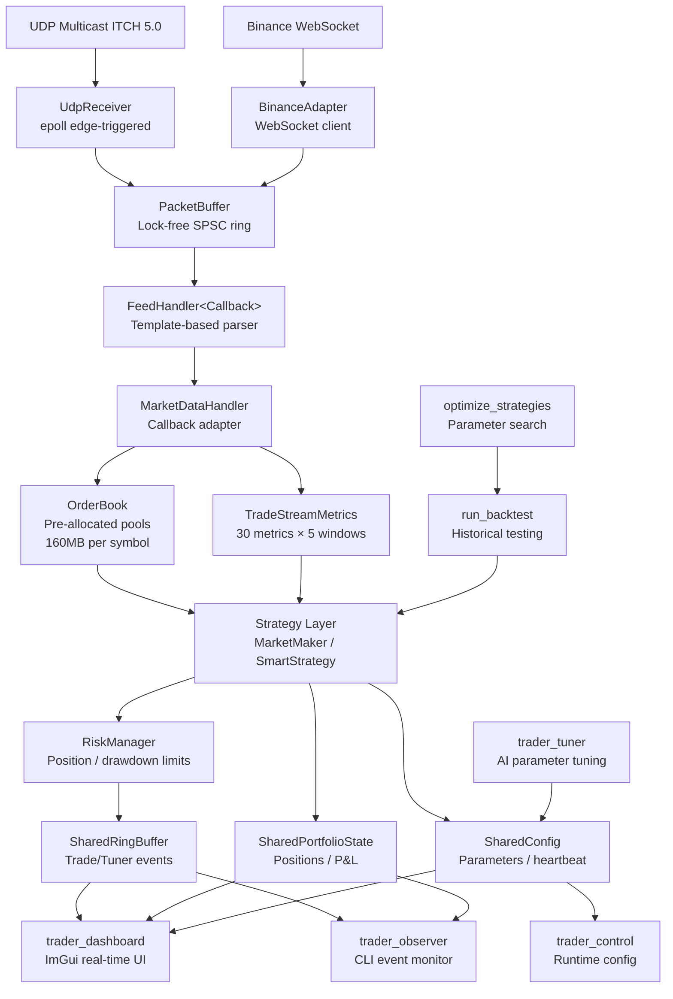
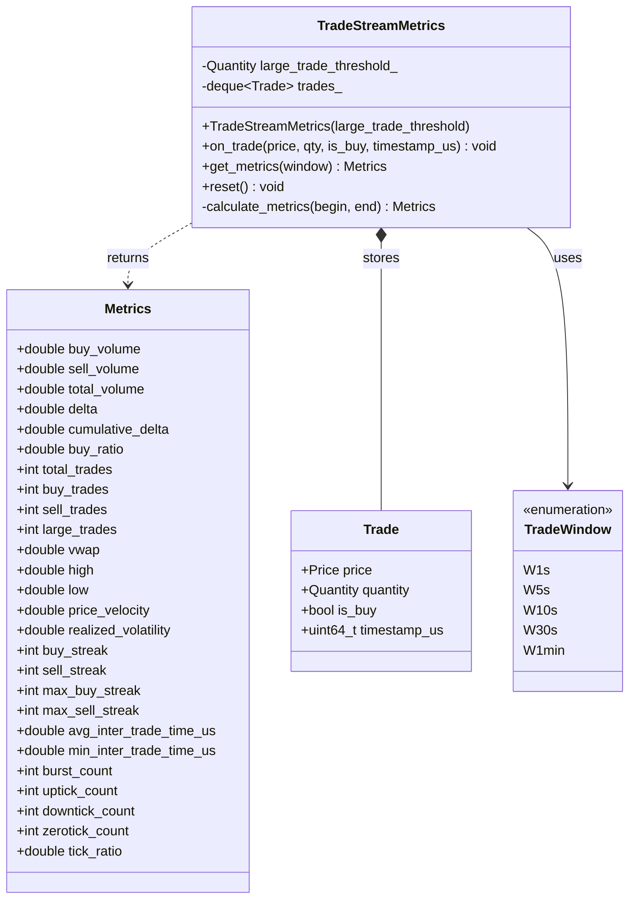

# HFT Trading System Architecture

This document provides a structural view of the HFT trading system. Read this before making any changes to understand component relationships and data flow.

## System Overview



---

## Module: Network

Handles UDP multicast and WebSocket connections with zero-copy packet buffering.


**Key Constraints:**
- `PacketBuffer` is lock-free SPSC (single-producer, single-consumer)
- `Capacity` must be power of 2
- `UdpReceiver` uses edge-triggered epoll for low latency
- No allocations on hot path

---

## Module: Feed Handler

Template-based protocol parser with compile-time callback binding (zero vtable overhead).


**Key Constraints:**
- `FeedHandler` is template-based (no virtual dispatch)
- Callback must satisfy `FeedCallback` concept
- Protocol-specific (ITCH 5.0), but same interface for other feeds
- Hot path: 3+ params allowed (exception to global rule)

---

## Module: Order Book

Pre-allocated pool-based order book with O(1) operations.


**Performance Baselines:**
- Cancel: < 500 ns
- Execute: < 500 ns
- Best Bid/Ask: < 25 ns
- Throughput: > 2M ops/sec

**Memory:**
- ~160MB per symbol (pre-allocated)
- MAX_ORDERS = 1M
- MAX_PRICE_LEVELS = 200K

---

## Module: Strategy

Trading strategies with position tracking and risk management.


**Key Constraints:**
- Position tracking is FIFO (First-In-First-Out)
- All P&L calculations in fixed-point (4 decimal places)
- No allocations on fill processing

---

## Module: Metrics

Header-only trade stream metrics library with rolling time windows.



**Metrics (30 metrics × 5 windows = 150 total):**
- **Volume:** buy_volume, sell_volume, total_volume
- **Delta:** delta, cumulative_delta, buy_ratio
- **Trade count:** total_trades, buy_trades, sell_trades, large_trades
- **Price:** vwap, high, low, price_velocity, realized_volatility
- **Streaks:** buy_streak, sell_streak, max_buy_streak, max_sell_streak
- **Timing:** avg_inter_trade_time_us, min_inter_trade_time_us, burst_count
- **Ticks:** uptick_count, downtick_count, zerotick_count, tick_ratio

**Time Windows:**
- 1s, 5s, 10s, 30s, 1min (rolling windows)

**Performance:**
- on_trade(): < 1 μs (tested: 0.108 μs)
- get_metrics(): < 5 μs (linear scan of window)
- Memory: O(trades in 1min window)

**Key Constraints:**
- Header-only (zero dependencies beyond std::deque, std::vector)
- No virtual functions
- Trades older than 1 minute are automatically pruned
- All metrics calculated on-demand (get_metrics)

---

## Module: IPC

Lock-free shared memory for inter-process communication.


**Memory Ordering:**
- Single-writer fields: `memory_order_relaxed`
- Cross-thread sync: `acquire/release`
- Price updates: < 5 cycles (relaxed)
- Position updates: < 10 cycles (relaxed)
- Heartbeat: < 100 cycles

**Testing Requirement:**
Any IPC struct change must be tested with all consumers running:
1. Terminal 1: `./trader --paper`
2. Terminal 2: `./trader_dashboard`
3. Terminal 3: `./trader_observer`

---

## Sequence Diagram: Market Data Flow


---

## Dependency Map


**External Dependencies:**
- NASDAQ ITCH 5.0 specification
- Binance WebSocket API (market data + user data streams)
- Linux kernel 3.9+ (epoll, shm_open, mmap)

**Build Requirements:**
- C++20 compiler (GCC 11+ or Clang 14+)
- CMake 3.20+
- POSIX-compliant OS (Linux, macOS)

**Third-Party Libraries:**
- Dear ImGui (dashboard UI, vendored)
- GoogleTest (testing, fetched by CMake)

---

## CI/CD Pipeline

### GitHub Actions Workflows


### Docker Builder Image

**Image:** `ghcr.io/orhanveliesen/hft-builder:latest`
**Base:** Ubuntu 22.04
**Pre-installed:**
- Build tools: cmake, build-essential (GCC 11)
- Dependencies: libwebsockets-dev, libglfw3-dev, libgl1-mesa-dev, libcurl4-openssl-dev
- Linting: clang-format
- Coverage: lcov, gcov
- Version control: git (for CMake commit hash)

**Performance Impact:**
- Before (apt install): 30-60s per workflow
- After (container pull): 2-5s per workflow
- **20-30x faster** dependency setup

### Workflow Dependencies

| Workflow | Container | Key Steps | Output |
|----------|-----------|-----------|--------|
| build-test.yml | hft-builder:latest | CMake Release build, 56 tests, magic number check | Build artifacts |
| lint.yml | hft-builder:latest | clang-format check | Pass/fail |
| codecov.yml | hft-builder:latest | Debug build with coverage, lcov report, 100% check | Coverage report |
| docker-build.yml | N/A | Build and push builder image | GHCR package |

### Coverage Enforcement

**100% line coverage required** (strict):
- Tool: lcov + gcov
- Exclusions: `/usr/*`, `*/external/*`, `*/tests/*`
- Unreachable error paths: Mark with `LCOV_EXCL_LINE`

Example:
```cpp
if (unlikely_error_condition) { // LCOV_EXCL_LINE
    handle_unreachable_error(); // LCOV_EXCL_LINE
} // LCOV_EXCL_LINE
```

### Local Development with Docker

```bash
# Pull latest builder image
docker pull ghcr.io/orhanveliesen/hft-builder:latest

# Build project
docker run --rm -v $(pwd):/workspace ghcr.io/orhanveliesen/hft-builder:latest \
  bash -c "mkdir -p build && cd build && cmake -DCMAKE_BUILD_TYPE=Release .. && make -j$(nproc)"

# Run tests
docker run --rm -v $(pwd):/workspace ghcr.io/orhanveliesen/hft-builder:latest \
  bash -c "cd build && ctest --output-on-failure"

# Format code
docker run --rm -v $(pwd):/workspace ghcr.io/orhanveliesen/hft-builder:latest \
  bash -c "find include tools tests benchmarks -type f \( -name '*.cpp' -o -name '*.hpp' \) -exec clang-format -i {} +"
```

---

## Hot Path Files

These files are on the critical latency path. Benchmark before/after changes.

| File | Impact | Benchmark |
|------|--------|-----------|
| `include/orderbook.hpp` | Order operations | `./bench_orderbook` |
| `include/feed_handler.hpp` | Message parsing | `./bench_feed_handler` |
| `include/network/packet_buffer.hpp` | Packet buffering | `./bench_packet_buffer` |
| `include/strategy/market_maker.hpp` | Quote generation | N/A (unit test timing) |
| `include/ipc/shared_portfolio_state.hpp` | IPC updates | `./bench_ipc` |

**Performance Regression = Immediate Revert**

Run benchmarks:
```bash
cd build
./bench_orderbook
./bench_feed_handler
./bench_packet_buffer
./bench_ipc
```

---

## Entry Points

### Production
- `tools/trader.cpp` - Main trading engine (paper/live)
  - Connects to UDP/WebSocket feeds
  - Runs strategies
  - Publishes to IPC

### Monitoring
- `tools/trader_dashboard.cpp` - Real-time ImGui dashboard
  - Reads IPC (portfolio state, config, events)
  - Displays P&L, positions, charts
  - Allows runtime config changes

- `tools/trader_observer.cpp` - CLI event monitor
  - Tails IPC event stream
  - Prints trade/tuner events to stdout

### Control
- `tools/trader_control.cpp` - Runtime parameter control
  - Writes to SharedConfig
  - Triggers manual tuning
  - Enables/disables trading

### Research
- `tools/run_backtest.cpp` - Historical backtesting
  - Replays kline data
  - Tests strategy performance

- `tools/optimize_strategies.cpp` - Parameter optimization
  - Grid search / genetic algorithm
  - Maximizes Sharpe ratio

- `tools/trader_tuner.cpp` - AI parameter tuning
  - Watches live performance
  - Adjusts strategy params dynamically

---

## Data Flow Summary

1. **Ingestion:** UDP/WebSocket → UdpReceiver → PacketBuffer (lock-free ring)
2. **Parsing:** FeedHandler (template) → MarketDataHandler (adapter)
3. **Market Data:** OrderBook (pre-allocated pools, O(1) ops)
4. **Strategy:** MarketMaker/SmartStrategy (regime analysis, signal generation)
5. **Risk:** RiskManager (position limits, drawdown, loss streak)
6. **IPC:** SharedMemory (relaxed atomics, < 10 cycles)
7. **Monitoring:** Dashboard/Observer (read-only consumers)

**Latency Budget:**
- Network to OrderBook update: < 10 μs
- OrderBook update to strategy signal: < 5 μs
- Strategy signal to IPC write: < 1 μs
- **Total (tick-to-signal): < 20 μs**

---

## Project Structure

```
include/
├── network/
│   ├── udp_receiver.hpp         # UDP multicast + epoll
│   └── packet_buffer.hpp        # Lock-free SPSC ring
├── feed_handler.hpp             # Template-based ITCH parser
├── market_data_handler.hpp      # Callback adapter
├── orderbook.hpp                # Pre-allocated pool-based book
├── book_side.hpp                # Bid/Ask side (template)
├── metrics/
│   └── trade_stream_metrics.hpp # Trade stream metrics (30 metrics × 5 windows)
├── strategy/
│   ├── position.hpp             # Position tracker (FIFO)
│   ├── market_maker.hpp         # Market making strategy
│   ├── smart_strategy.hpp       # Regime-based adaptive strategy
│   └── risk_manager.hpp         # Risk checks
├── ipc/
│   ├── shared_config.hpp        # Runtime config (bidirectional)
│   ├── shared_portfolio_state.hpp # Portfolio snapshot
│   ├── shared_ring_buffer.hpp   # Event stream (SPSC)
│   └── trade_event.hpp          # Event types
└── types.hpp                    # Core types (Price, Quantity, Side)

tools/
├── trader.cpp                   # Main trading engine
├── trader_dashboard.cpp         # ImGui dashboard
├── trader_observer.cpp          # CLI event monitor
├── trader_control.cpp           # Runtime control
├── trader_tuner.cpp             # AI parameter tuning
├── run_backtest.cpp             # Backtesting engine
└── optimize_strategies.cpp      # Parameter optimizer

tests/                           # 57 test suites (including 34 metrics tests)
benchmarks/                      # Performance benchmarks
├── bench_orderbook.cpp          # OrderBook performance
├── bench_lockfree.cpp           # Lock-free buffer performance
└── bench_trade_stream_metrics.cpp # Metrics performance
```

---

## Key Design Decisions

### 1. Template-Based Polymorphism (Not Virtual)
- `FeedHandler<Callback>` uses C++20 concepts
- Zero vtable overhead on hot path
- Compile-time callback binding

### 2. Pre-Allocated Pools (Not Dynamic Allocation)
- OrderBook pools: 160MB per symbol
- No `new`/`delete` on hot path
- Intrusive linked lists (no `std::list`)

### 3. Lock-Free IPC (Not Mutexes)
- Single-writer, multiple-readers
- `memory_order_relaxed` for price updates (< 5 cycles)
- `acquire/release` for cross-thread sync

### 4. Shared Memory (Not Sockets)
- Zero-copy communication
- Dashboard reads without trader overhead
- Version check via git commit hash

### 5. Edge-Triggered Epoll (Not Level-Triggered)
- Reduces syscalls
- Batches packet reads
- Lower latency

---

## Updating This Document

**When to update:**
1. New class/module added → Add to class diagram
2. Relationship changed → Update relevant diagram
3. New dependency → Update dependency map
4. New entry point → Update entry points section

**After completing a task:**
1. Review changes to core modules
2. Update affected diagrams
3. Commit ARCHITECTURE.md with code changes

**This is a living document. Keep it synchronized with the codebase.**

